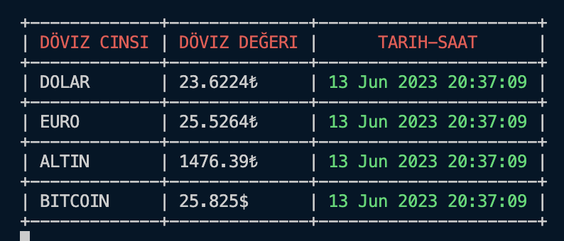

# Döviz CLI Tool

 

Döviz CLI Tool, anlık olarak döviz ve Bitcoin kurlarını takip etmenizi sağlayan bir komut satırı aracıdır. Program, Go programlama dili kullanılarak geliştirilmiştir ve standart olarak USD/TRY, EUR/TRY, GAU/TRY ve BTC/USD kurlarını sunar.

## Özellikler

-   Anlık olarak döviz kurlarını takip edebilme
-   USD/TRY, EUR/TRY, GAU/TRY ve BTC/USD kurlarını görüntüleme
-   Son güncellenen tarih ve saat bilgisini gösterme

## Gereksinimler

-   İşletim Sistemi: Windows, macOS, Linux
-   [Go](https://golang.org/dl/) sürüm 1.15 veya üstü

## Kurulum

1.  İlk olarak, Go'nun sisteminizde yüklü olduğundan emin olun. Eğer Go henüz yüklü değilse, aşağıdaki adımları takip ederek yükleyebilirsiniz:
    
    -   **Windows**:
        
        -   İndirme sayfasına gidin: [https://golang.org/dl/](https://golang.org/dl/)
        -   İndirilen `.msi` uzantılı dosyayı çalıştırın ve kurulum sihirbazını takip edin.
        -   Yükleme tamamlandıktan sonra, komut istemcisini yeniden başlatın ve `go version` komutunu çalıştırarak yüklü olan Go sürümünü kontrol edin.
    -   **macOS**:
        
        -   İndirme sayfasına gidin: [https://golang.org/dl/](https://golang.org/dl/)
        -   İndirilen `.pkg` uzantılı dosyayı çift tıklayarak kurulumu başlatın ve kurulum sihirbazını takip edin.
        -   Yükleme tamamlandıktan sonra, Terminal uygulamasını açın ve `go version` komutunu çalıştırarak yüklü olan Go sürümünü kontrol edin.
    -   **Linux**:
        
        -   Terminal uygulamasını açın ve aşağıdaki komutları sırasıyla çalıştırarak Go'yu yükleyin:
            
            bashCopy code
            
            `sudo apt update
            sudo apt install golang` 
            
        -   Yükleme tamamlandıktan sonra, terminalde `go version` komutunu çalıştırarak yüklü olan Go sürümünü kontrol edin.
2.  Döviz CLI Tool'u yerel bir dizine klonlayın:
    
    bashCopy code
    
    `git clone https://github.com/sgok/doviz-cli-tool.git` 
    
3.  Klonladığınız dizine gidin:
    
    bashCopy code
    
    `cd doviz-cli-tool` 
    
4.  Programı derleyin:
    
    bashCopy code
    
    `go build doviz.go` 
    

## Kullanım

1.  Döviz CLI Tool dizinindeyken, aşağıdaki komutu çalıştırarak programı başlatın:
    
    bashCopy code
    
    `./doviz` 
    
2.  Program, anlık döviz kurlarını ve Bitcoin değerini ekranda gösterecektir.
    

## Lisans

Bu proje MIT Lisansı ile lisanslanmıştır.

----------

**Not:** Bu projenin gerçek zamanlı döviz ve Bitcoin verilerine bağlı olduğunu unutmayın. Programın çıktısı, kullanılan API hizmetinin sağladığı verilere dayanmaktadır ve her zaman güncel olmayabilir. API adresini kendinize göre değiştirebilir veya kendi API adresinizi kullanabilirsiniz. API Endpoint'inin sonsuza kadar ayakta kalacağının garantisini veremeyiz.